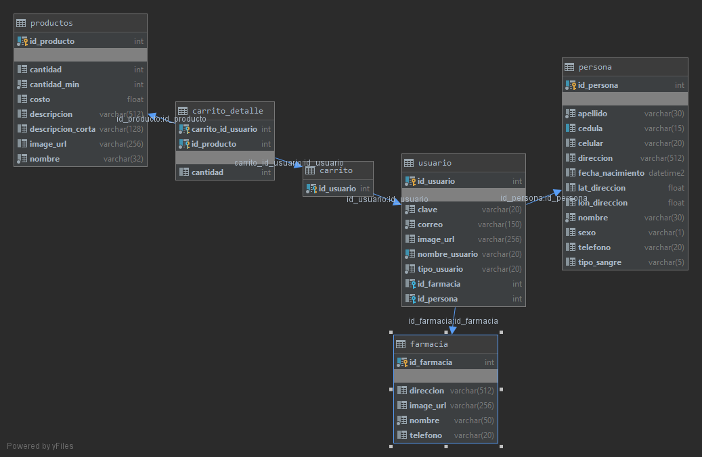
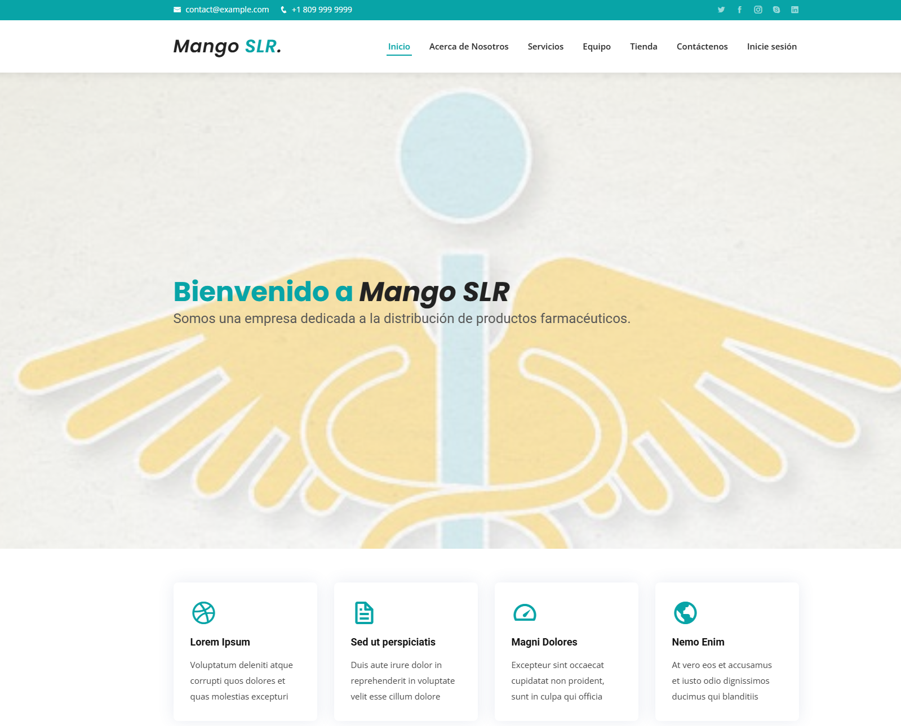
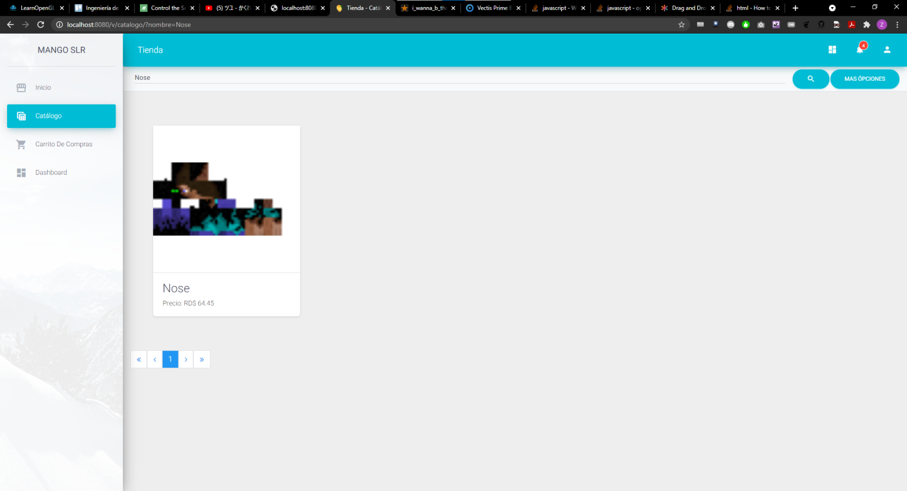
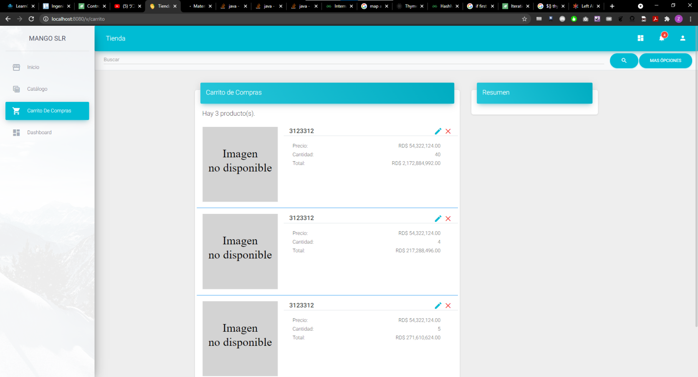
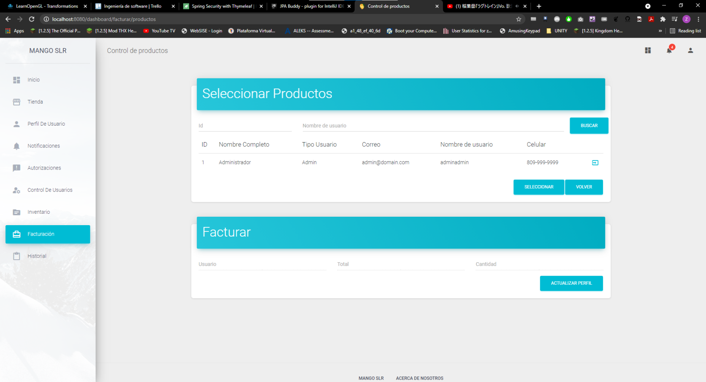
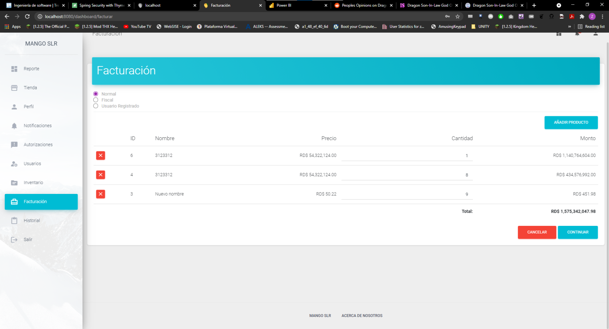

# Mango SLR Farmacia en línea - Proyecto Ingeniería de Software - Enero de 2022

## Elaborado por

- Audric Rosario
- Zhen Peng Li
- Rafael Peguero

### Utiliza:

- Backend Springboot
- Base de datos Microsoft SQL Server
- Llamadas a API de prueba de PayPal (versión deprecada - 2022)

### Estructura de base de datos

### Página principal

### Tienda

### Carrito de compras

### Facturación

### Pago de factura

